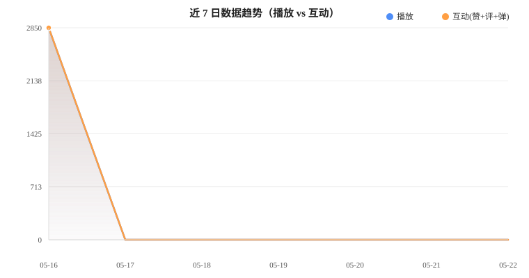

# B站运营日报 — 2026-05-23

> 账号：`_泡椒味泡椒_`（UID `1079191158`）  
> 生成时间：2026-05-23 23:30 (Asia/Shanghai)

---

## 📊 数据概览

| 指标 | 近7日汇总 |
|------|-----------|
| 播放 | 2,850 |
| 点赞 | 119 |
| 投币 | 8 |
| 收藏 | 46 |
| 评论 | 80 |
| 弹幕 | 3 |
| 分享 | 0 |
| 粉丝数 | 2,392 |

### 近 7 日趋势

### 单条高表现视频

| 视频 | 播放 | 点赞 | 投币 | 收藏 | 评论 | 弹幕 |
|------|------|------|------|------|------|------|
| [高版本的最强srp类模组斗蛐蛐！](https://www.bilibili.com/video/BV1mnLn6VEiw) | 2,178 | 87 | 6 | 42 | 57 | 3 |
| [危机合约：共存行动](https://www.bilibili.com/video/BV1yLL56pEYd) | 672 | 32 | 2 | 4 | 23 | 0 |

### 互动结构（近7日加权）

| 比率 | 数值 | 评价 |
|------|------|------|
| 点赞率 | **4.17%** (119/2850) | ✅ 偏高，内容共鸣强 |
| 评论率 | **2.81%** (80/2850) | ✅ 优秀，互动意愿高 |
| 投币率 | **0.28%** (8/2850) | ⚠️ 偏低，需引导 |
| 收藏率 | **1.61%** (46/2850) | ⚠️ 中等，可提升 |

---

## 🚀 未来发展方向

1. **系列化「斗蛐蛐next」**：已有9集系列基础（总播放 5.8万），持续更新可形成稳定流量池，建议每周 1-2 更。
2. **挑战/极限类内容放大**：「危机合约」和「重开五次」这类高难度挑战视频评论率突出，适合做"观众投票选挑战"互动模式。
3. **优化投币引导话术**：当前投币率仅 0.28%，在视频结尾用具体话术（"投币=投票决定下期玩什么"）可显著提升。
4. **封面与标题统一风格**：目前标题风格差异较大（有感叹号型、疑问型），建议统一为「关键词+悬念」格式提升点击率。
5. **弹幕互动设计**：弹幕量极低（仅 3 条），可在视频中设置"弹幕打卡点"（如"打出XX解锁下一关"）。

## ⚠️ 注意事项

1. **更新频率不稳定**：近7日仅 2 天有更新，其余 5 天空白，算法推荐会衰减，建议保持至少隔日更。
2. **投币率断崖偏低**：点赞率 4.17% vs 投币率 0.28%，说明观众"看了喜欢但不掏钱"，需在内容中增加"支持UP主"的情感触点。
3. **内容同质化风险**：账号以 Minecraft 整合包为主，需定期引入新玩法/新模组避免审美疲劳。

---

## 🎬 视频题材建议

| # | 选题 | 卖点 | 系列化方式 |
|---|------|------|------------|
| 1 | 《斗蛐蛐next S2：谁是版本之子？》 | 用新赛季/新模组开启第二季，延续已有粉丝粘性 | 连续剧情（每期淘汰制） |
| 2 | 《100天极限生存：观众选的整合包》 | 让评论区投票选整合包，参与感拉满 | 投票互动（每期观众决定下期） |
| 3 | 《模组斗蛐蛐：经典 vs 新锐 横评》 | 对比测评同类模组，给明确结论和推荐 | 挑战/测评系列 |
| 4 | 《危机合约全难度通关挑战》 | 从简单到地狱难度逐级挑战，失败名场面剪辑 | 挑战系列（每期一个难度） |

---

*数据来源：B站公开API（移动端兼容接口），因风控限制部分高级指标未获取。*
